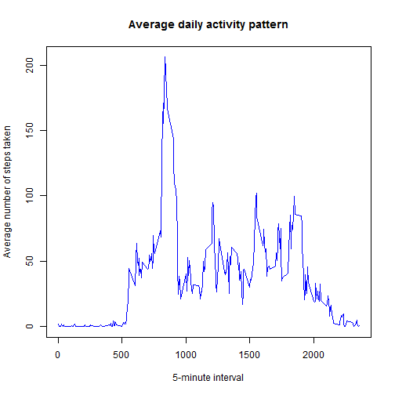

# Reproducible Research: Peer Assessment 1

---


## Loading and preprocessing the data

Read in the data.


```r
setwd("F:/Data Science/Coursera - Reproducible Research/RepData_PeerAssessment1")
unzip("activity.zip", "activity.csv")
actDf <- read.table("activity.csv", sep = ",", header = TRUE)
```

Processing the data into a suitable format for analysis.


```r
library(dplyr)
```

```
## Warning: package 'dplyr' was built under R version 3.1.2
```

```
## 
## Attaching package: 'dplyr'
## 
## The following object is masked from 'package:stats':
## 
##     filter
## 
## The following objects are masked from 'package:base':
## 
##     intersect, setdiff, setequal, union
```

```r
raw_tblDf <- tbl_df(actDf)
tblDf <- filter(raw_tblDf, !is.na(steps))
```

## What is mean total number of steps taken per day?


```r
byDate <- group_by(tblDf, date)
totalSteps_day <- summarize(byDate, sum(steps))
colnames(totalSteps_day) <- c("date", "sumSteps")
```

Make a histogram of the total number of steps taken each day


```r
hist(totalSteps_day$sumSteps, main="Number of Steps",
     xlab="Total number of steps taken each day", col="light blue")
```

 

Calculate and report the mean and median total number of steps taken per day


```r
mean(totalSteps_day$sumSteps)
```

```
## [1] 10766.19
```

```r
median(totalSteps_day$sumSteps)
```

```
## [1] 10765
```

## What is the average daily activity pattern?


```r
byInterval <- group_by(tblDf, interval)
meanStep_Interval <- summarize(byInterval, mean(steps))
colnames(meanStep_Interval) <- c("interval", "steps")
```

Make a time series plot (i.e. type = "l") of the 5-minute interval (x-axis) and the average number of steps taken, averaged across all days (y-axis)


```r
plot(meanStep_Interval$interval, meanStep_Interval$steps, type="l", 
     col="blue",
     xlab="5-minute interval", 
     ylab="Average number of steps taken",
     main="Average daily activity pattern")
```

 

Which 5-minute interval, on average across all the days in the dataset, contains the maximum number of steps?


```r
filter(meanStep_Interval, steps == max(steps))$interval
```

```
## [1] 835
```

## Imputing missing values

Calculate and report the total number of missing values in the dataset (i.e. the total number of rows with NAs)


```r
sum(is.na(raw_tblDf$steps))
```

```
## [1] 2304
```

Fill NA's with average for that 5-min interval. Create a new dataset that is equal to the original dataset but with the missing data filled in.


```r
temp_raw_tblDf <- cbind(raw_tblDf, meanStep_Interval$steps)
colnames(temp_raw_tblDf) <- c("steps", "date", "interval", "avgSteps")
filled_tblDf <- raw_tblDf

for(i in 1:nrow(filled_tblDf))    {
    if(is.na(filled_tblDf$steps[i]))
        filled_tblDf$steps[i] <- temp_raw_tblDf$avgSteps[i]
}
```

Make a histogram of the total number of steps taken each day for filled data


```r
byDate1 <- group_by(filled_tblDf, date)
totalSteps_day1 <- summarize(byDate1, sum(steps))
colnames(totalSteps_day1) <- c("date", "sumSteps")

hist(totalSteps_day1$sumSteps, main="Number of Steps (filled values)",
     xlab="Total number of steps taken each day", col="light blue")
```

 

Calculate and report the mean and median total number of steps taken per day for filled data


```r
mean(totalSteps_day1$sumSteps)
```

```
## [1] 10766.19
```

```r
median(totalSteps_day1$sumSteps)
```

```
## [1] 10766.19
```
Mean values didn't change, because we supplied interval average for the given interval. Histogram and median changed somewhat. Median value has slightly increased.


## Are there differences in activity patterns between weekdays and weekends?
Create a new factor variable in the dataset with two levels - "weekday" and "weekend" indicating whether a given day is a weekday or a weekend


```r
library(lattice)
allDays <- weekdays(as.Date(filled_tblDf$date))
data_with_days <- transform(filled_tblDf, day = allDays)
data_with_days$wk <- ifelse(data_with_days$day %in% c("Saturday", "Sunday"),"weekend", "weekday")
library(plyr)
```

```
## Warning: package 'plyr' was built under R version 3.1.2
```

```
## -------------------------------------------------------------------------
## You have loaded plyr after dplyr - this is likely to cause problems.
## If you need functions from both plyr and dplyr, please load plyr first, then dplyr:
## library(plyr); library(dplyr)
## -------------------------------------------------------------------------
## 
## Attaching package: 'plyr'
## 
## The following objects are masked from 'package:dplyr':
## 
##     arrange, count, desc, failwith, id, mutate, rename, summarise,
##     summarize
```

```r
average_by_interval_wk <- ddply(data_with_days, .(interval, wk), summarise, steps=mean(steps))
xyplot(steps ~ interval | wk, data = average_by_interval_wk, layout = c(1, 2), type="l")
```

 
